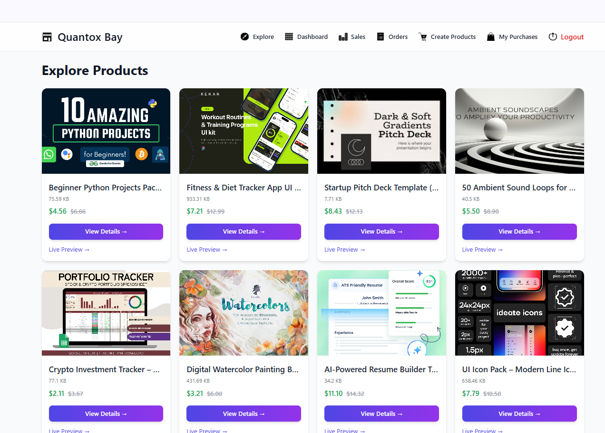
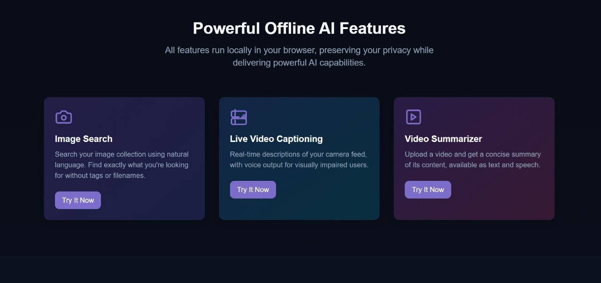
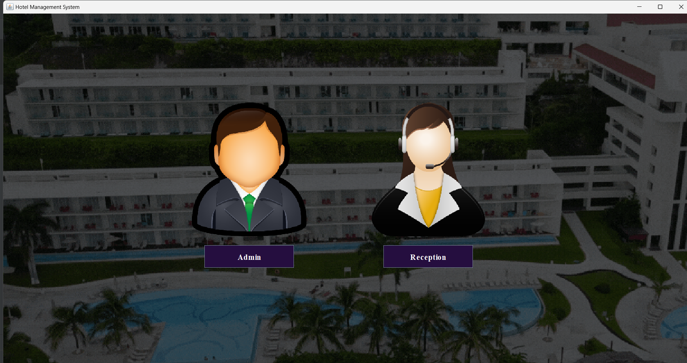
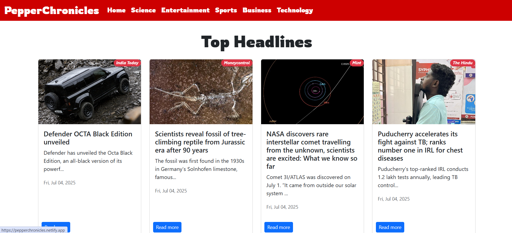

<!-- Banner -->

  

<!-- Intro -->
<h1 align="center">Hey, I'm Vedant 👋</h1>

  <strong>Full-Stack Engineer • Django Wizard • Java Dev • Product-First Builder</strong> 
  <em>Think Fast. Build Bold. Always Ship.</em>

---

<!-- Tech Stack -->
### 🧠 Tech Arsenal

  

---

<!-- Projects Showcase -->
### 🚀 Featured Projects

  <table>
    <tr>
      <td align="center" width="50%">
          
        <strong>Quantox Bay</strong> 
        <em>Django multivendor marketplace with Stripe, EC2 & Cloudinary.</em> 
        <a href="https://quantoxbay.onrender.com">🌐 Live Demo</a>
      </td>
      <td align="center" width="50%">
          
        <strong>Insight AI</strong> 
        <em>AI tools for visually impaired users and keyword-based image search.</em> 
        <a href="https://github.com/vedantmpatil/Insight-AI">📂 View Code</a>
      </td>
    </tr>
    <tr><td colspan="2"> </td></tr>
    <tr>
      <td align="center" width="50%">
          
        <strong>HotelEase</strong> 
        <em>Java Swing system with real-time hotel room and staff management.</em> 
        <a href="https://github.com/vedantmpatil/Hotel-Management-System-">📂 View Code</a>
      </td>
      <td align="center" width="50%">
          
        <strong>PepperChronicles</strong> 
        <em>ReactJS news app with category filtering and API integration.</em> 
        <a href="https://pepperchronicles.netlify.app/">🌐 Visit Site</a>
      </td>
    </tr>
  </table>

---

<!-- Socials -->
### 🌐 Socials:

  
  
  
  

---

<!-- Contributions Count -->
### 📊 My GitHub Contributions

  
  

---

<!-- Collaborate -->
### 🤝 Let’s Collaborate!

  

  <em>“Be intentional toward the main character in you — build and live the life you want.”</em>

---

✨ Thanks for visiting! ✨

