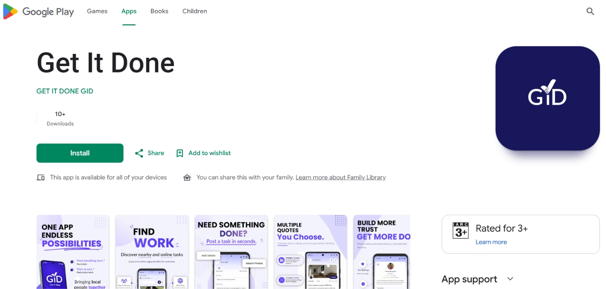
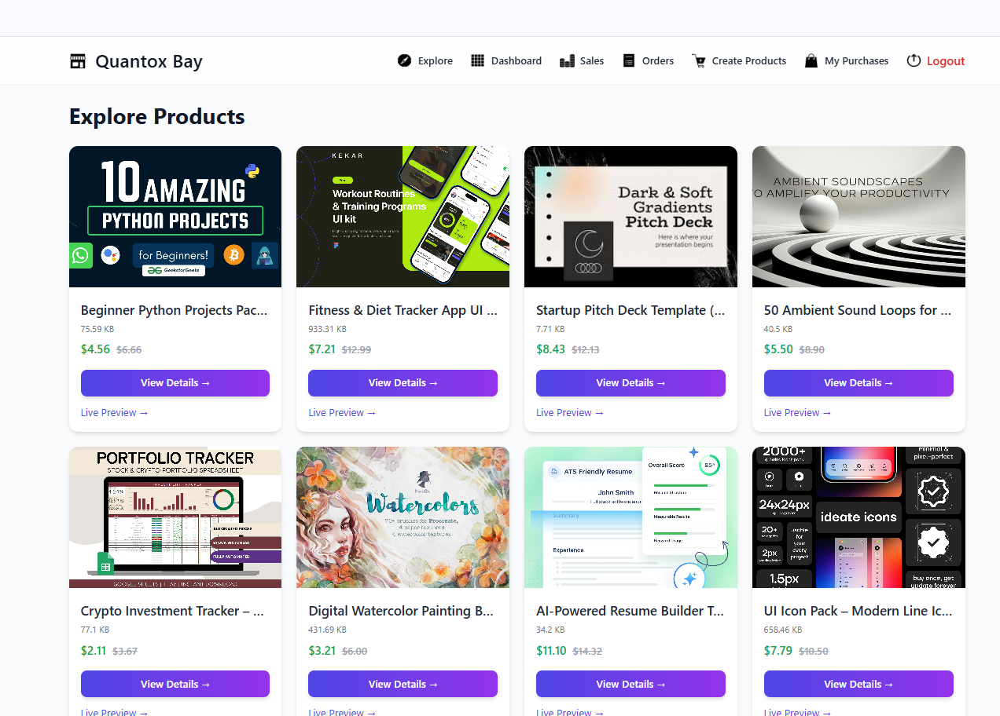
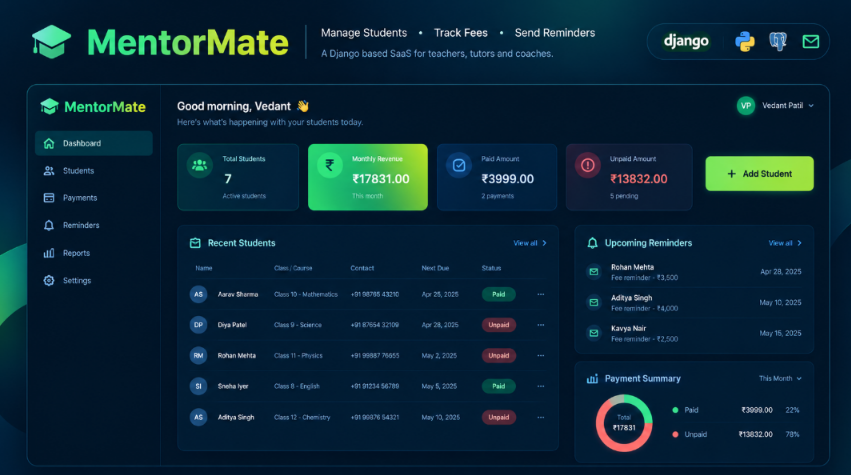
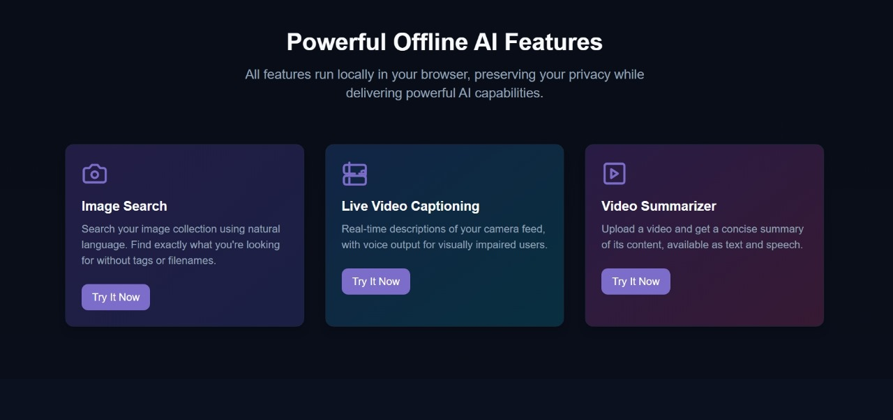

<!-- Banner -->

  

<!-- Intro -->
<h1 align="center">Hey, I'm Vedant 👋</h1>

  <strong>Full Stack Developer • Django • React • Java</strong>

  <em>I like turning ideas into working software.</em>

  
  &nbsp;
  
  &nbsp;
  
  &nbsp;
  
  &nbsp;
  
  
  &nbsp;

---

## 🧠 Tech Stack

  

<table align="center">
<tr>
<td><strong>Backend</strong></td>
<td>Django • Django REST Framework • PostgreSQL • MySQL</td>
</tr>
<tr>
<td><strong>Frontend</strong></td>
<td>React • JavaScript • HTML • CSS • Tailwind</td>
</tr>
<tr>
<td><strong>Development</strong></td>
<td>Java • Docker • Git • REST APIs • Deployment</td>
</tr>
</table>

---

## AI & Modern Development

I use AI both as a development tool and as a building block for software — from rapid prototyping and assisted coding to integrating AI capabilities into real applications.

<table>
<tr>
<td width="33%" valign="top">

**01 · INTEGRATE**

OpenAI APIs • Google APIs • Computer Vision • AI Features

</td>

<td width="33%" valign="top">

**02 · BUILD & ASSIST**

ChatGPT • Claude • Coding Agents • Lovable • AI-assisted Debugging

</td>

<td width="33%" valign="top">

**03 · EXPERIMENT**

AI APIs • External Models • Rapid Prototyping • Automation

</td>
</tr>
</table>

> **AI is a force multiplier, not a replacement for engineering fundamentals.**
> I use it to work smarter, prototype faster, solve problems, and stay current with modern development.

---

# 🚀 Featured Projects

<table>
<tr>

<td width="50%" align="center" valign="top">

### 🟢 Get It Done

Production local services marketplace built with Django.

**Django • DRF • PostgreSQL • Render • Cloudflare R2**

Backend architecture, REST APIs, database design, deployment, integrations and team coordination.

</td>

<td width="50%" align="center" valign="top">

### 🟣 Quantox Bay

Django based digital marketplace for selling downloadable products.

**Django • PostgreSQL • Stripe • Docker**

Authentication, product management, payments, media handling and marketplace workflows.

</td>

</tr>

<tr>

<td width="50%" align="center" valign="top">

### 🟢 MentorMate

A Django based SaaS concept built for an entrepreneur to manage students and mentoring payments.

**Django • PostgreSQL • Email**

Student management, fee tracking, payment status and one click email reminders for parents.

</td>

<td width="50%" align="center" valign="top">

### 🔵 Insight AI

Final year AI project exploring image understanding and accessibility.

**Python • Streamlit • AI/ML**

Image search, live video captioning, video summarization and an accessibility focused use case.

</td>

</tr>
</table>

---

## 🧪 Experiments & Builds

Smaller projects, prototypes and client builds where I explored different technologies and ideas.

<table>
<tr>

<td width="50%" valign="top">

### 💰 Quick Hisab

**React • Tauri • SQLite**

Offline desktop ledger built for a client with local data storage, account management, reports and Excel backup.

</td>

<td width="50%" valign="top">

### 🏷️ Tag Spark Visual

**React • TypeScript • Flask • AI/ML**

Full stack AI image tagging and search using BLIP, spaCy and natural language queries.

</td>

</tr>

<tr>

<td width="50%" valign="top">

### 🧠 Sentiment Highlighter

**JavaScript • Chrome Extension • NLP**

Browser extension using Hugging Face NLP to analyze sentiment and highlight web content.

</td>

<td width="50%" valign="top">

### 🔐 Steganography

**JavaScript • Cryptography • Web**

Browser based tool for hiding and extracting messages through image and linguistic steganography.

</td>

</tr>

<tr>

<td width="50%" valign="top">

### 🏨 Hotel Management System

**Java • Swing • MySQL • JDBC**

Desktop application exploring Java, OOP and database driven application development.

</td>

<td width="50%" valign="top">

### 📓 iNoteBook

**React • Node.js • MongoDB • JWT**

Full stack note taking application with authentication and CRUD functionality.

</td>

</tr>
</table>

  

---

  <strong><em>“Always learning. Always building. Always experimenting.”</em></strong>

