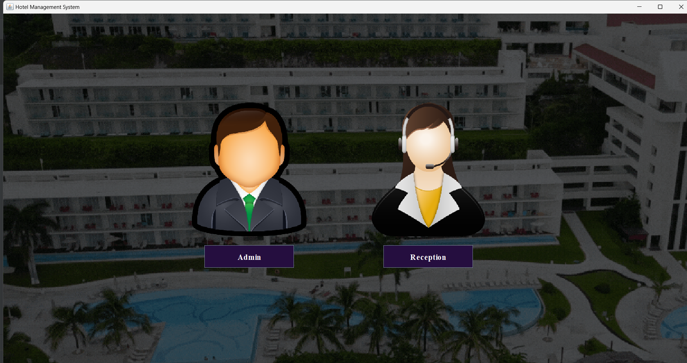

<!-- Banner -->
<p align="center">
  
</p>

<!-- Intro -->
<h1 align="center">Hey, I'm Vedant 👋</h1>

<p align="center">
  <strong>Full Stack Developer • Django • React • Java</strong>
</p>

<p align="center">
  <em>I like turning ideas into working software.</em>
</p>

<p align="center">
  <a href="https://www.linkedin.com/in/vedant-patil-389b862a6/">
    
  </a>
  <a href="mailto:vedantmpatilofficial@gmail.com">
    
  </a>
  <a href="https://github.com/vedantmpatil">
    
  </a>
</p>

---

## 🧠 Tech Stack

<p align="center">
  
</p>

<p align="center">
  <strong>Backend</strong> Django • Django REST Framework • PostgreSQL • MySQL
  <br>
  <strong>Frontend</strong> React • JavaScript • HTML • CSS • Tailwind
  <br>
  <strong>Other</strong> Java • Docker • Git • REST APIs • Deployment
</p>

---

## 🤖 AI & Modern Development

I actively experiment with AI tools and APIs to build faster, automate repetitive work, and explore new product ideas.

<table>
<tr>
<td width="50%" valign="top">

### AI Integration

• OpenAI APIs and content moderation  
• Google APIs and location services  
• AI powered application features  
• API based AI experimentation  
• Prompt driven workflows  

</td>

<td width="50%" valign="top">

### AI Assisted Development

• AI assisted coding workflows  
• Rapid prototyping and product development  
• Prompt engineering  
• Using AI for debugging and implementation  
• Exploring practical LLM workflows  

</td>
</tr>
</table>

> I focus on using AI as a development tool and integrating it into practical software rather than treating AI as a separate technology from application development.

---

# 🚀 Featured Projects

<table>
<tr>

<td width="50%" align="center" valign="top">


### 🟢 Get It Done

Production local services marketplace built with Django.

**Django • DRF • PostgreSQL • Render • Cloudflare R2**

Backend architecture, REST APIs, database design, deployment, third party integrations and team coordination.

<a href="YOUR_GID_PROJECT_LINK">📂 Explore Project</a>

</td>

<td width="50%" align="center" valign="top">


### 🟣 Quantox Bay

Django based digital marketplace for selling downloadable products.

**Django • PostgreSQL • Stripe • Docker**

Full stack marketplace with authentication, product management, payments and media handling.

<a href="https://github.com/vedantmpatil/Quantoxbay">📂 Explore Project</a>

</td>

</tr>

<tr>

<td width="50%" align="center" valign="top">


### 🟢 MentorMate

A Django based SaaS concept built for an entrepreneur to manage students and mentoring payments.

**Django • PostgreSQL • Email**

Student management, fee tracking, payment status and one click email reminders for parents.

<a href="YOUR_MENTORMATE_REPO_LINK">📂 Explore Project</a>

</td>

<td width="50%" align="center" valign="top">


### 🔵 Insight AI

Final year AI project exploring image understanding and accessibility.

**Python • Streamlit • AI/ML**

Image search, live video captioning, video summarization and an accessibility focused use case.

<a href="YOUR_LIVE_CAPTIONING_REPO_LINK">📂 Explore Project</a>

</td>

</tr>

<tr>

<td width="50%" align="center" valign="top">



### 🟠 Hotel Management System

Desktop hotel management application built to explore Java application development.

**Java • Swing • MySQL • JDBC**

Reception, administration, employee management, room tracking and hotel operations.

<a href="https://github.com/vedantmpatil/Hotel-Management-System-">📂 Explore Project</a>

</td>

<td width="50%" align="center" valign="top">

<h3>🧪 More Experiments</h3>

Smaller projects and experiments across web development, Django, React, APIs, JavaScript, AI and automation.

<br><br>

<a href="https://github.com/vedantmpatil?tab=repositories">
  
</a>

</td>

</tr>
</table>

---

## 🧪 Experiments & Builds

Some of the smaller things I've built or explored:

`Django` `REST APIs` `React` `JavaScript` `Java` `Flask` `AI APIs` `Computer Vision` `Browser Extensions` `Automation`

These include smaller learning projects, prototypes and experiments that helped me explore different technologies and development approaches.

---

## 📌 What I Enjoy Building

```text
Backend systems       → Django • REST APIs • PostgreSQL
Full Stack products   → Django + React
Product prototypes    → Turning ideas into working software
AI integrations       → APIs • automation • AI assisted workflows
Application design    → From architecture to deployment
